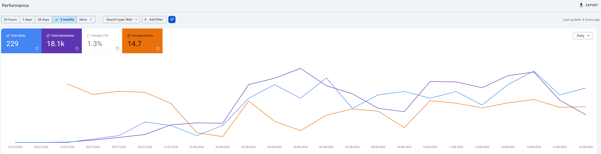
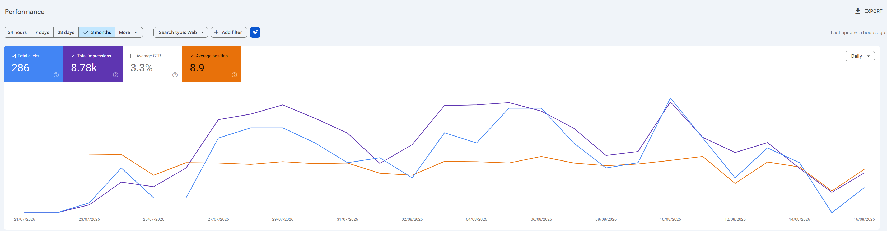
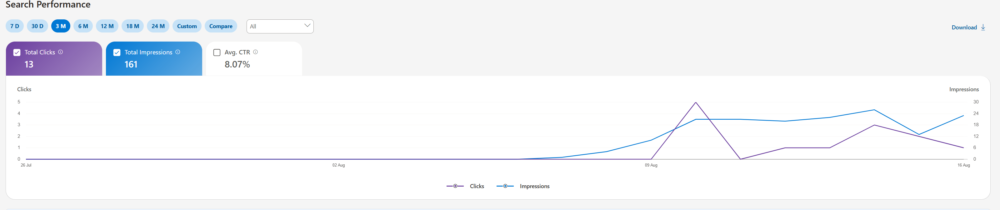
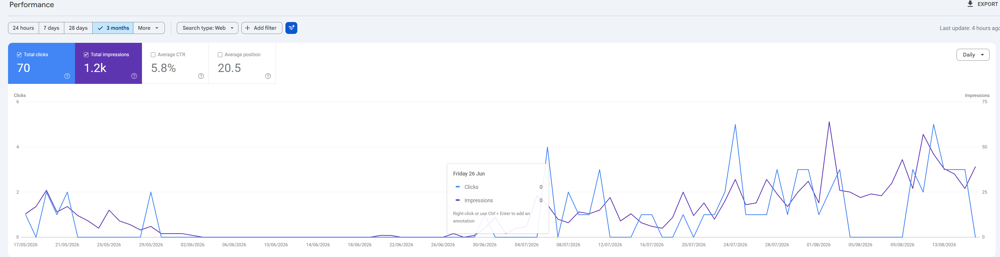
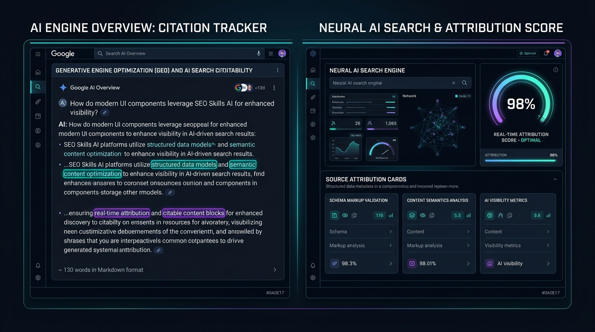

# SEO Skills: Universal AI SEO Agent & Technical Optimization Suite

<p align="center">
  
</p>


[](LICENSE)
[](https://github.com/seoskillsai/seo-skills-ai/actions/workflows/ci.yml)
[](https://github.com/seoskillsai/seo-skills-ai/actions/workflows/plugin-scan.yml)
[](AGENTS.md)
[](skills/)
[](https://seoskillsai.com)

> **SEO Skills** is the universal, open-source AI search engine optimization skill suite and audit engine for modern AI coding agents — including **Anthropic Claude Code**, **Google Antigravity IDE**, **Cursor IDE**, **Windsurf Cascade**, **GitHub Copilot**, **OpenAI ChatGPT / Codex**, **Cline & Roo Code**, **Aider CLI**, and **DeepSeek R1**.

Built upon the **Holistic Semantic SEO Framework**, **Google Information Gain Patent US 11,562,019 B2**, **2026 Google Search Essentials**, and the open **Agent Skills Specification**, SEO Skills delivers **27 modular sub-skills**, **18 specialist sub-agents**, first-party Python adapters (DataForSEO, Firecrawl, Bing Webmaster, IndexNow), optional **third-party vendor MCP** (Ahrefs, SE Ranking, Profound, Banana, Unlighthouse), and a deterministic zero-telemetry Python execution engine.

---

## 📈 Real-World Performance & Empirical Results

SEO Skills is proven across both **brand-new domains** launched from scratch and **established websites recovering from algorithmic decay**:

### 1. Brand New Sites: Instant Google Indexation & Organic Ranking
Empirical Google Search Console trajectory for brand new domains launched with SEO Skills structured EAV entity modeling and Schema.org graphs:


*Figure 1 (illustrative): Google Search Console performance UI. Property, date range, and filters are whatever appears in the screenshot — not a live export from this repository.*


*Figure 2 (illustrative): GSC query/page table for an example property. Treat as a UI example, not packaged ranking proof.*

---

### 2. Multi-Engine Indexation: Bing & IndexNow Batch Discovery
Accelerated crawl discovery and top-tier rankings on Bing Search via unified Bing Webmaster and IndexNow automation:


*Figure 3 (illustrative): Bing Webmaster Tools UI for an example site and date range.*

---

### 3. Established Domain Recovery: Algorithmic Turnaround
Resolving technical debt, deprecated schemas, and thin content to recover decaying legacy properties:


*Figure 4 (illustrative): Search performance chart for a recovering property. Filters and dates are those shown in the image.*

---

## Installation

Clone the repository and open it as the agent workspace.

```bash
git clone https://github.com/seoskillsai/seo-skills-ai.git
cd seo-skills-ai
node packages/cli/index.mjs add cursor
```

`@seoskillsai/cli` is packaged for npm (`package.json` `files` includes `skills/`, `scripts/`, and `AGENTS.md`) but is **not on the registry yet** — there is no npm token in the local credential files. Do not run `npx @seoskillsai/cli` until a public `1.2.0` tarball exists.

Unix / macOS:

```bash
bash install.sh
```

Windows (PowerShell):

```powershell
powershell -ExecutionPolicy Bypass -File .\install.ps1
```

Then point Claude Code, Cursor, Antigravity, Windsurf, Codex, or Cline at this folder. Skills load from `skills/`. Optional Playwright Chromium is installed by `install.sh` / `install.ps1` for screenshots.

### Claude Code CLI

```text
/plugin marketplace add seoskillsai/seo-skills-ai
/plugin install seo-skills@seoskillsai-seo-skills
/seo setup
/seo doctor
```

### Cline / Roo MCP

Copy `config/cline_mcp_settings.json` into your Cline MCP settings. Tools are **not** auto-approved; the host must confirm `seo_audit` and `seo_drift` because they fetch the URL you pass.

---

## 🏛️ What Makes SEO Skills Superior to Legacy Tools


Traditional SEO auditing tools (such as standalone browser extensions or single-agent plugins) rely on superficial regex scripts, obsolete Schema.org types, and generic prompt checklists. **SEO Skills** operates as an autonomous, multi-agent intelligence layer that executes deterministic code, inspects DOM rendering pipelines, and enforces holistic semantic authority:

| Capability | Legacy Tools (`claude-seo`) | **SEO Skills (`seoskillsai`)** |
| :--- | :--- | :--- |
| **Agent Ecosystem** | Claude Code only | **100% Universal** (Claude, Antigravity, Cursor, Windsurf, Copilot, ChatGPT, Cline, Aider) |
| **Semantic SEO Framework** | Surface keyword density checklists | **Holistic Semantic SEO** (EAV modeling, 800+ word educational prose, directional PageRank conduits) |
| **Information Gain Scoring** | ❌ None (Generic advice) | **Google Patent US 11,562,019 B2 Engine** (`scripts/information_gain.py` scoring empirical data density & novelty) |
| **Code Remediation** | Text recommendations only | **Review-only patch generator** (`scripts/remediation_engine.py` prints HTML/Astro snippets; it never writes or `git apply`s them) |
| **Recursive Site Crawler** | Single-page checks only | **Multi-Page Async Site Crawler** (`scripts/site_crawler.py` mapping depth, orphan pages, & sitewide anchor distributions) |
| **2026 Schema Validation** | Deprecated types (`HowTo`, `FAQPage`) | **Strict 2026 Google Compliance** (Nested `@graph`, zero deprecated types, deep required property validation) |
| **Google Discover & Media RSS** | ❌ None | **Discover Image SEO** (`max-image-preview:large` + Media RSS `<media:content>` 1200px feeds + AI Editorial Bylines) |
| **AI Search & LLM Citations** | Vague GEO suggestions | **Dynamic `llms.txt` / `llms-full.txt` Generator** + AI bot permission manager (`GPTBot`, `ClaudeBot`, `Google-Extended`) |
| **Site Reputation Abuse** | Basic rule check | **Deep Parasite SEO Scanner** (`scripts/parasite_seo.py` analyzing affiliate footprints, intent mismatch, and subfolder isolation) |
| **Next-Gen Web Standards** | Standard CWV audits | **W3C Speculation Rules & bfcache Analyzer** (`scripts/speculation_rules.py`) + **Google Consent Mode v2 Validator** (`scripts/consent_mode.py`) |
| **Regression Monitoring** | Manual checks | **Continuous SQLite On-Page Drift Engine** (17 automated comparison rules flagging title, robots, schema, or content changes) |

---

## 🔍 Generative Engine Optimization (GEO) & AI Search Citability



Google AI Overviews, Perplexity Pro, and ChatGPT Search extract **130–170 word self-contained semantic answer passages** directly from structured content. SEO Skills audits passage citability, question-based heading hierarchies, and entity attribution density to ensure your brand is cited as the primary authority.

---

## 🛠️ The 27 Modular SEO Skills Catalog

Every command in SEO Skills can be executed directly from your terminal CLI or invoked conversationally inside any AI agent workspace.

### Core Audits & Architecture
- `/seo audit <url>`: Parallel full-site audit dispatching up to 15 specialist agents across technical, content, schema, GEO, and link vectors.
- `/seo technical <url>`: Comprehensive 9-category technical audit (Core Web Vitals INP/LCP/CLS, HTTP security headers, canonical loops, redirect chains, SPA hydration markers).
- `/seo crawl <url> [max_pages]`: Recursive multi-page site crawler mapping internal PageRank link graphs, crawl depth distribution ($\le 2$ clicks), and orphan pages.
- `/seo drift <url>`: SQLite on-page baseline snapshotting and 17-rule regression comparator to detect deployment code regressions.
- `/seo fix <url>`: Prints HTML/Astro remediation snippets for **review**. Does not modify the repository.

### Semantic Content & Topical Authority (Semantic SEO Standard)
- `/seo content <url>`: Holistic semantic content audit applying Entity-Attribute-Value (EAV) modeling and anti-thin educational prose validation ($800+$ words).
- `/seo content-brief <topic>`: Generates intent-grounded content briefs with macro/micro context, heading hierarchies, and directional link conduit targets.
- `/seo cluster <seed>`: SERP-overlap semantic keyword clusterer grouping search queries by top-10 URL overlap ($ \ge 4$ overlapping URLs = single pillar).
- `/seo info-gain <url>`: Google Patent US 11,562,019 B2 analyzer evaluating empirical data density, entity novelty, and SERP consensus deviation.
- `/seo flow [stage]`: 7-layer recursive multi-agent execution prompt flow guiding copywriters from entity research to final publication.

### Structured Data & AI Search (GEO / AEO)
- `/seo schema <url>`: 2026 Google-compliant JSON-LD structured data validator and generator (enforces nested `@graph` with `TechArticle`, `Product`, `BreadcrumbList`).
- `/seo llms-txt <url>`: Dynamic `/public/llms.txt` and `/public/llms-full.txt` generator structuring site documentation for LLM ingestion.
- `/seo robots-ai <url>`: AI crawler permissions manager balancing citation discovery (`GPTBot`, `ClaudeBot`, `Google-Extended`) with scraper protection.
- `/seo geo <url>`: Generative Engine Optimization audit scoring passage-level answer citability ($130–170$ word self-contained blocks) and attribution density.
- `/seo discover <url>`: Google Discover image optimization, `<media:content>` 1200px 16:9 Media RSS XML feed builder, and First-Exposure AI Editorial Byline disclosures.

### Local SEO, Maps Intelligence & E-Commerce
- `/seo local <url>`: Google Business Profile audit, NAP consistency across citation networks, and multi-location doorway page threshold guardrails ($30/50$ limits).
- `/seo maps <url>`: Geo-grid ranking radius analysis, review sentiment trends, and local competitor proximity mapping.
- `/seo ecommerce <url>`: E-commerce product schema validator (`hasMerchantReturnPolicy`, `shippingDetails`, `aggregateRating`, `gtin13`, IPTC `TrainedAlgorithmicMedia`).
- `/seo competitor-pages <url>`: Generates competitor comparison and alternative landing page architectures ("X vs Y").
- `/seo programmatic <url>`: Programmatic SEO template generator with anti-thin quality gates preventing doorway penalties.
- `/seo hreflang <url>`: Multi-regional and multi-lingual Hreflang reciprocity validator and XML sitemap generator.

### APIs, Performance & Reporting
- `/seo google [command]`: PSI/CrUX without OAuth; GSC Search Analytics and GA4 organic sessions only after `~/.config/seoskillsai/google_credentials.json` exists (otherwise `UNAVAILABLE`, no invented numbers).
- `/seo backlinks <url>`: Free backlink profile and referring domain audit via Common Crawl Open Web Graph, Moz Free API, and Bing Webmaster Tools.
- `/seo images <url>`: Visual semantic image audit, next-gen WebP/AVIF compression analysis, and IPTC AI generation metadata verification.
- `/seo report <url>`: Generates executive-ready HTML and 200 DPI vector PDF audit reports with visual health scorecards.
- `/seo doctor`: System diagnostic utility checking Python runtime, SQLite databases, and agent harness readiness.
- `/seo setup`: Runtime provisioner bootstrapping isolated virtual environments and baseline databases.

---

## Vendor APIs: first-party HTTP vs third-party MCP

This repo owns a small set of Python HTTP clients. Other vendors are **official MCP servers you run with their keys**; we do not bundle those servers.

**First-party (our HTTP, credentials from env / `~/.config/seoskillsai/`):**

| Adapter | Script | Credentials |
| --- | --- | --- |
| DataForSEO SERP + volume | `scripts/dataforseo_api.py` | `DATAFORSEO_LOGIN` / `DATAFORSEO_PASSWORD` |
| Firecrawl scrape | `scripts/firecrawl_api.py` | `FIRECRAWL_API_KEY` |
| Bing Webmaster metrics | `scripts/bing_webmaster.py` | `BING_WEBMASTER_API_KEY` |
| IndexNow submit | `scripts/indexing_notify.py` | IndexNow key (required; no fake accepted counts) |
| GSC / GA4 | `scripts/gsc_query.py`, `scripts/ga4_report.py` | OAuth file from `google_oauth.py` |

**Third-party MCP (not our implementation):** Ahrefs (`@ahrefs/mcp`), SE Ranking, Profound, Banana, Unlighthouse. See `extensions/*/README.md`. Example MCP snippets use `${ENV}` placeholders — never commit empty `"API_KEY": ""` as if it were a secret.

---

## 🧠 Topical & Semantic SEO Principles

SEO Skills is founded upon the **Topical Authority & Semantic SEO Standard**, prioritizing topical source context and mathematical link equity over superficial keyword density:

1. **Entity-Attribute-Value (EAV) Modeling:**
   Every topic is constructed around a central entity ($E_0$), associated secondary entities ($E_1 \dots E_n$), defining attributes ($A$), and verified contextual values ($V$).
2. **Directional PageRank Conduits:**
   Link equity flows systematically upwards and horizontally: Outer Cluster Nodes $\rightarrow$ Category Silo Hub $\rightarrow$ Core Flagship Pillar.
3. **3x Anchor Text Diversity Rule:**
   Exact-match target keyword anchor text must never appear more than **3 times across the entire website**. Partial-match and semantic variations prevent over-optimization penalties.
4. **Anti-Thin Educational Prose Architecture:**
   Interactive tools, calculators, and widgets must be grounded with **800+ words of structured educational body prose** to satisfy Google Quality Rater Guidelines (QRG §4.6.5).
5. **Centerpiece Above-the-Fold Annotation:**
   The primary interactive element or direct answer must render within the top **350px viewport** (<600px mobile) to prevent centerpiece demotion penalties.

---

## Security & Privacy

- **No product telemetry:** Audits and SQLite baselines stay on your machine. SEO Skills AI does not send analytics to seoskillsai.com.
- **Network-target policy:** User-supplied URLs go through `scripts/url_safety.py` (scheme, DNS fail-closed, private/metadata IP block, **redirect re-check**). Optional allowlist: `SEOSKILLS_ALLOWED_HOSTS`. Headless Chromium uses the same policy for navigation and blocks private-IP subresources.
- **Repo scope:** Generated files stay under `SEOSKILLS_OUT_DIR` (default: cwd). Remediation patches are review-only.
- **MCP:** Shipped Cline config does not `autoApprove` fetch tools.
- **Host-agent hooks:** `hooks/hooks.json` PreToolUse runs `hook_validate_fetch.py` / `hook_validate_write.py` on stdin JSON (no `{file}` shell interpolation).
- **Playwright:** navigation and private-IP subresources are aborted. Set `SEOSKILLS_STRICT_BROWSER=1` to apply `SEOSKILLS_ALLOWED_HOSTS` to subresources too.
- **Optional vendor APIs:** PageSpeed, CrUX, RDAP, IndexNow, DataForSEO, Firecrawl, Bing Webmaster, and third-party MCP send the URL you asked to audit to those vendors when you run those commands.
- **Credentials:** Optional keys in `~/.config/seoskillsai/` with `0o600` permissions, gitignored.

See [SECURITY.md](SECURITY.md).

---

## 📚 Knowledge Databases & References

Explore our comprehensive reference library directly inside the repository:
- [Deployment map (`docs/DEPLOYMENT.md`)](./docs/DEPLOYMENT.md)
- [Google Algorithm Updates Database (`data/google-updates.json`)](./data/google-updates.json)
- [2026 Active Schema.org Catalog (`skills/seo-schema/references/schema-types-2026.md`)](./skills/seo-schema/references/schema-types-2026.md)
- [Deprecated Schema Migration Guide (`skills/seo-schema/references/deprecated-types-guide.md`)](./skills/seo-schema/references/deprecated-types-guide.md)
- [Semantic SEO EAV Methodology Reference (`skills/seo-content/references/semantic-eav-methodology.md`)](./skills/seo-content/references/semantic-eav-methodology.md)
- [10-Principle Falsifiable Thinking Framework (`skills/seo/references/thinking-framework.md`)](./skills/seo/references/thinking-framework.md)
- [Helpful Content Fluff Removal Rubric (`skills/seo-content/references/helpful-content-humanizer.md`)](./skills/seo-content/references/helpful-content-humanizer.md)

---

## 📜 License & Open Source

SEO Skills AI is released under the **MIT License** — free forever for personal, consultant, agency, and enterprise commercial use.

- **Web Portal & Documentation:** [seoskillsai.com](https://seoskillsai.com)
- **GitHub Repository:** [github.com/seoskillsai/seo-skills-ai](https://github.com/seoskillsai/seo-skills-ai)
- **Community Issues:** [GitHub Issues](https://github.com/seoskillsai/seo-skills-ai/issues)
