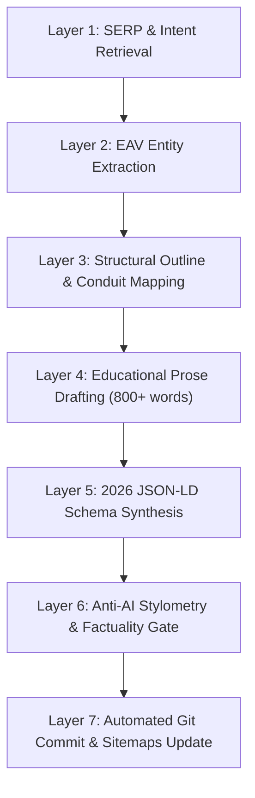

# 7-Layer Recursive Multi-Agent Prompt Flow

Choreographs autonomous subagents through a deterministic, evidence-grounded production pipeline.

---

## 🔄 The 7 Execution Layers

1. **Layer 1: Intent & SERP Retrieval:** Fetch top 10 search results and analyze user intent modality.
2. **Layer 2: EAV Entity Extraction:** Extract Subject-Predicate-Object triples and LSI attributes.
3. **Layer 3: Structural Outline:** Generate heading hierarchy with strict internal link conduits.
4. **Layer 4: Educational Prose:** Draft body copy with centerpiece viewport annotation (<350px).
5. **Layer 5: Schema Synthesis:** Emit valid `TechArticle`, `SoftwareApplication`, and `BreadcrumbList` graphs.
6. **Layer 6: Quality Gate:** Check against 3x anchor text diversity limit and verify zero deprecated schemas.
7. **Layer 7: Commit & Publish:** Update dynamic HTML and XML sitemaps and commit changes.
